# Active Directory Enterprise Lab

## Project Overview

I built this home lab to get real practice with Active Directory and the kind of work I would be doing in an IT support or system administration job.

For the lab, I created a fictional company called BWA Stay Hotel. I used it to practice managing users, groups, permissions, support tickets, and common problems that can happen in a Windows domain.

My main goal was to understand how everything works together by actually doing the work instead of only reading about it.

## Lab Environment

| Component | How I Used It |
|---|---|
| Windows Server 2025 | Used as the domain controller and hosted the main server services |
| Windows 11 | Used as the client computer for logins and testing |
| VirtualBox | Used to create and run both virtual machines |
| lab.local | Used as the Active Directory domain |

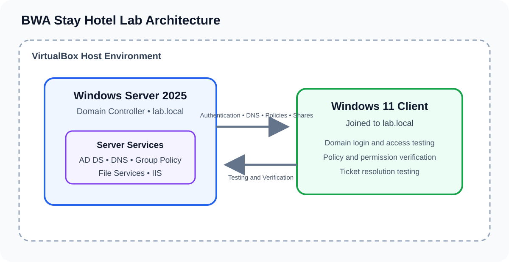

The Server Manager dashboard shows the roles and services I installed for the lab.

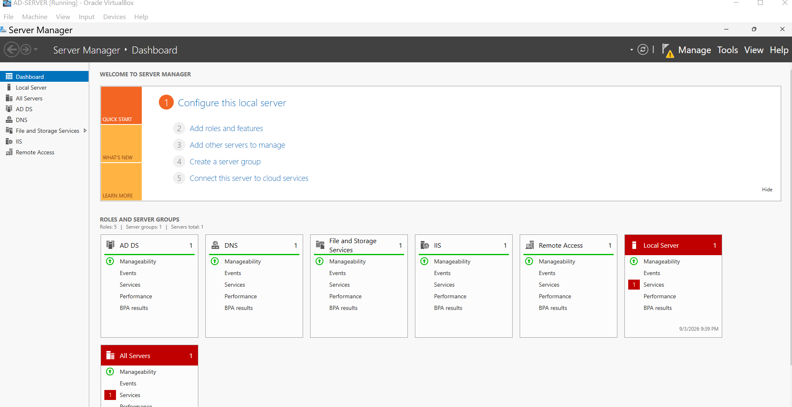

## Active Directory Administration

I used Active Directory Users and Computers to practice tasks that come up in IT support.

* Creating user accounts
* Resetting passwords
* Unlocking accounts
* Adding users to security groups
* Changing access when someone changes roles
* Disabling accounts
* Checking my work after making changes

I kept disabled accounts in a separate OU. This lets me keep the account for records without leaving it active.

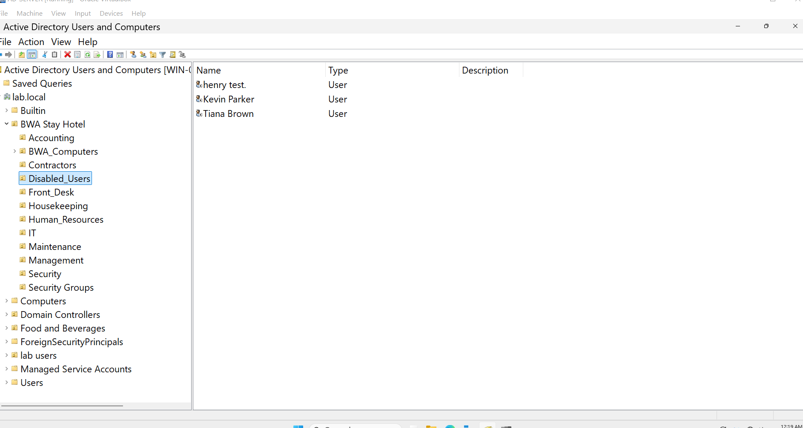

## Organizational Units and Security Groups

I created an OU structure for BWA Stay Hotel so users and computers could be organized by department. The departments include Accounting, Front Desk, Housekeeping, Human Resources, IT, Maintenance, Management, and Security.

I also created security groups for each department. This made it easier to control access based on a person's job instead of giving permissions to every user one at a time.

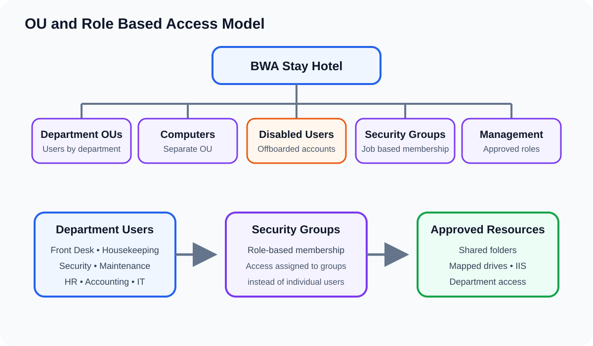

This screenshot shows one of the department groups and the users assigned to it.

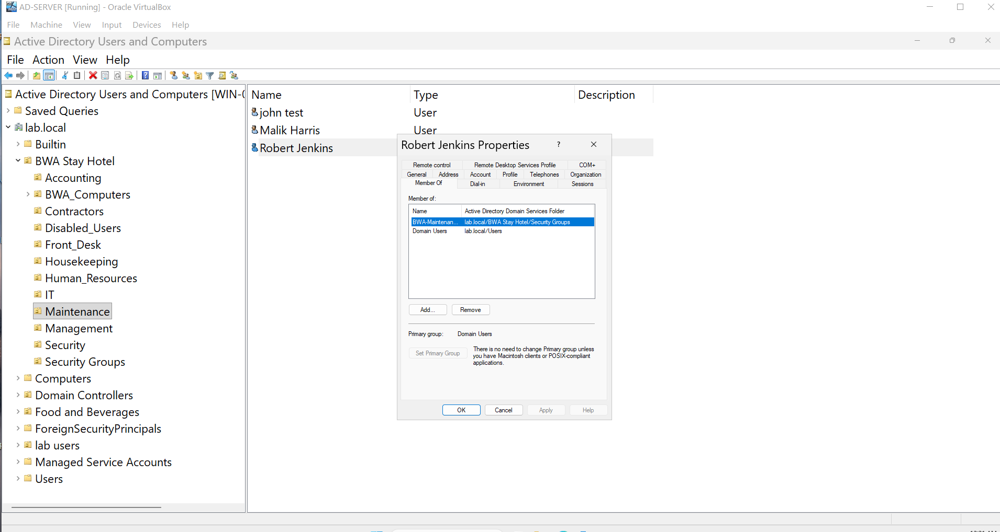

## Help Desk Ticketing

I used Jira Service Management and Spiceworks to practice working through support tickets. For each request, I checked the problem, made the needed change, tested the result, and updated the ticket.

[View my Help Desk Ticket Lab](help-desk-tickets/README.md)

## PowerShell Administration

I used PowerShell along with Active Directory Users and Computers. I started by learning how commands are put together and then used them to view, create, and check things inside Active Directory.

Some of the tasks I practiced were:

* Viewing Organizational Units
* Creating Organizational Units
* Checking changes I made
* Viewing users and groups
* Reading cmdlets, parameters, and values

I am still building my PowerShell skills because I want to understand the commands instead of only copying scripts.

I also used PowerShell to check the active domain password and lockout settings after updating Group Policy.

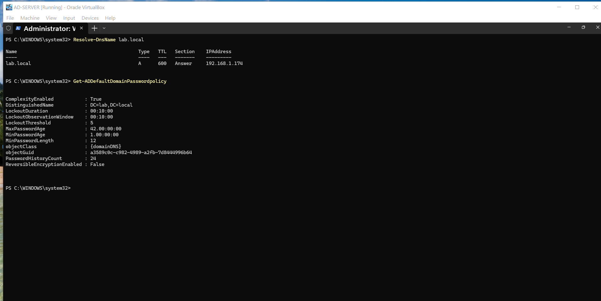

## File and Access Management

I practiced creating shared folders for different departments, assigning permissions, and checking access. This helped me understand how security groups work with share and NTFS permissions.

I also found and corrected a permission problem that gave departments access to folders they did not need.

[View the Department Folder Permission Troubleshooting case](help-desk-tickets/department-folder-permissions.md)

## Group Policy

I reviewed the password settings in the Default Domain Policy and found that the minimum password length was set to 7 characters.

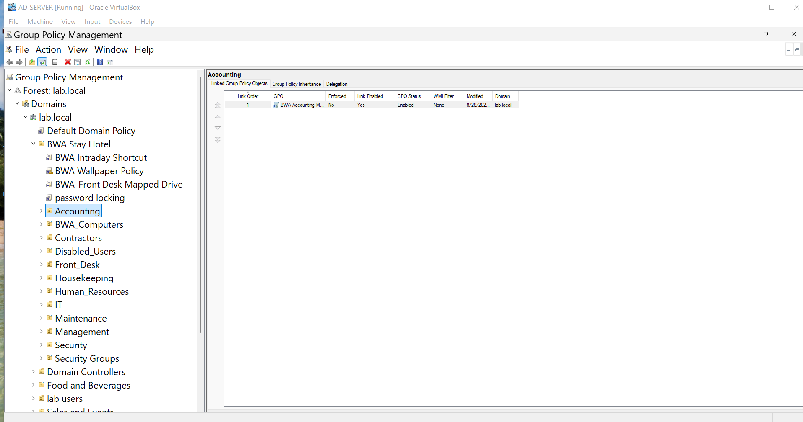

I changed the minimum password length to 12 characters. I kept password history at 24, password complexity enabled, and reversible encryption disabled.

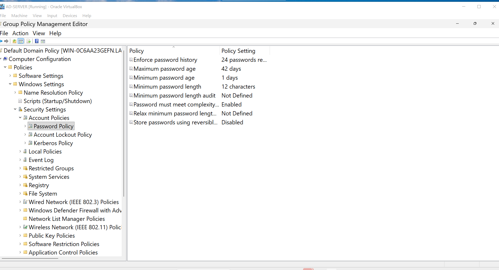

I also reviewed the account lockout policy. It locks an account after 5 failed attempts for 10 minutes, resets the counter after 10 minutes, and includes the Administrator account.

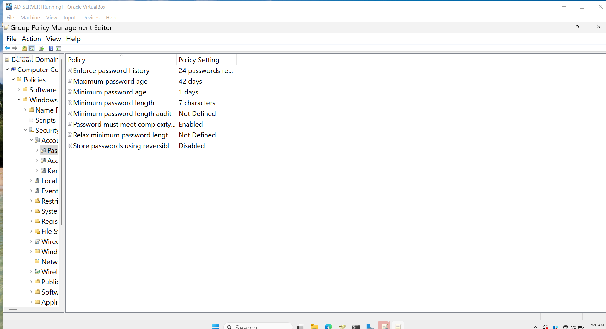

I backed up the Group Policy Objects so the settings can be restored if a policy is changed or deleted.

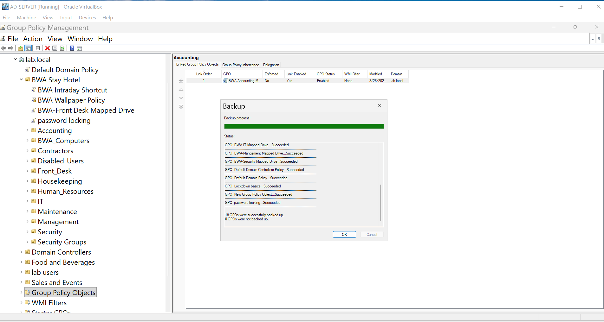

I also used Group Policy to manage settings for domain users and computers. One of the policies I worked on was a company wallpaper for the Windows 11 client. When it did not apply correctly, I had to go back through the settings and troubleshoot it.

## DNS Configuration

I used DNS Manager to review the records in the lab.local zone. The zone includes records for the domain controller, Windows client, and internal website.

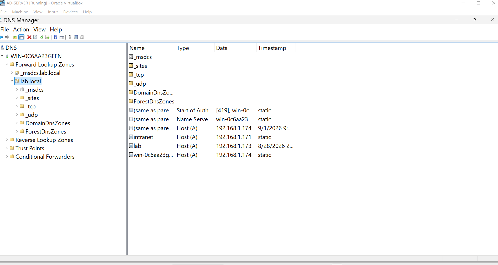

## Security Auditing

I configured the domain controller to record successful and failed logins, credential checks, user account changes, and security group changes.

[View my Security Auditing documentation](documentation/security-auditing.md)

## Troubleshooting

Not everything worked the first time. I had to troubleshoot PowerShell errors, Active Directory changes, login issues, DNS problems, Group Policy, and folder permissions.

When something went wrong, I checked the settings, looked at what I changed, tested possible fixes, and then made sure the final result worked.

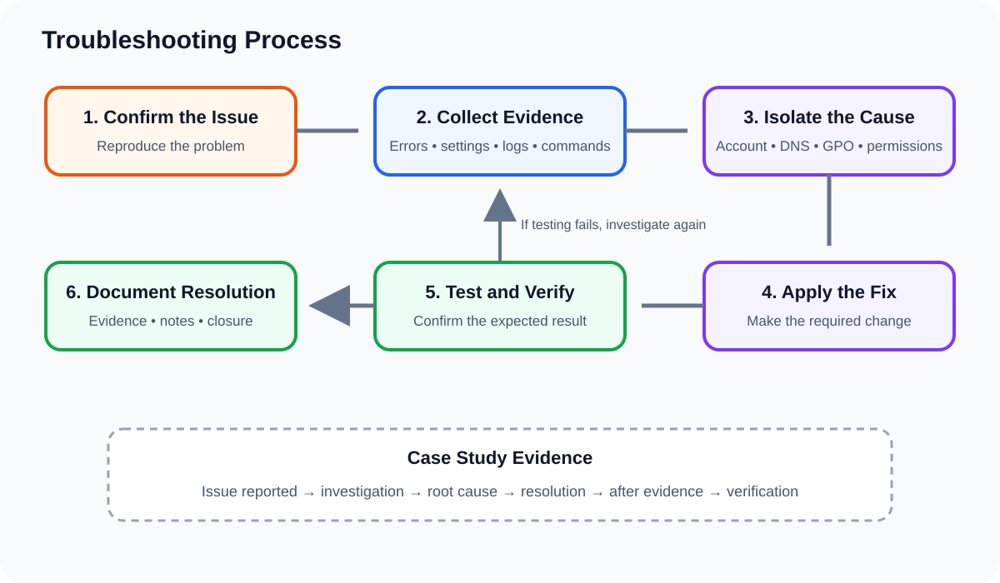

## Tools and Technologies

| Technology | How I Used It |
|---|---|
| Windows Server 2025 | Hosted the domain and server services |
| Active Directory Domain Services | Managed users, OUs, groups, and accounts |
| Windows 11 | Tested domain logins, permissions, and policies |
| PowerShell | Completed and checked administrative tasks |
| Group Policy | Managed settings for domain users and computers |
| Jira Service Management | Tracked simulated support requests |
| Spiceworks | Practiced help desk ticket management |
| VirtualBox | Created and ran the virtual machines |
| DNS | Handled name resolution for the domain |
| IIS | Hosted and tested an internal website |

## Skills Practiced

* Active Directory user management
* Organizational Units and security groups
* Password resets and account unlocking
* User setup and account disabling
* Access and permission management
* Windows Server administration
* Windows domain testing
* Help desk ticket handling
* PowerShell fundamentals
* Group Policy
* File shares and NTFS permissions
* DNS and connectivity troubleshooting
* Testing and documenting my work

## What I Learned

This lab helped me see how Active Directory, Windows Server, a client computer, permissions, and support tickets connect to each other.

I became more comfortable creating users, organizing accounts, managing access, and checking changes from a Windows 11 client. I also learned that troubleshooting is a big part of the work. When something does not work, I have to slow down, check the setup, test possible causes, and confirm the fix.

PowerShell also showed me why it is important to understand what a command is doing. Jira and Spiceworks helped me connect the technical work to the way a support request would be handled from start to finish.
