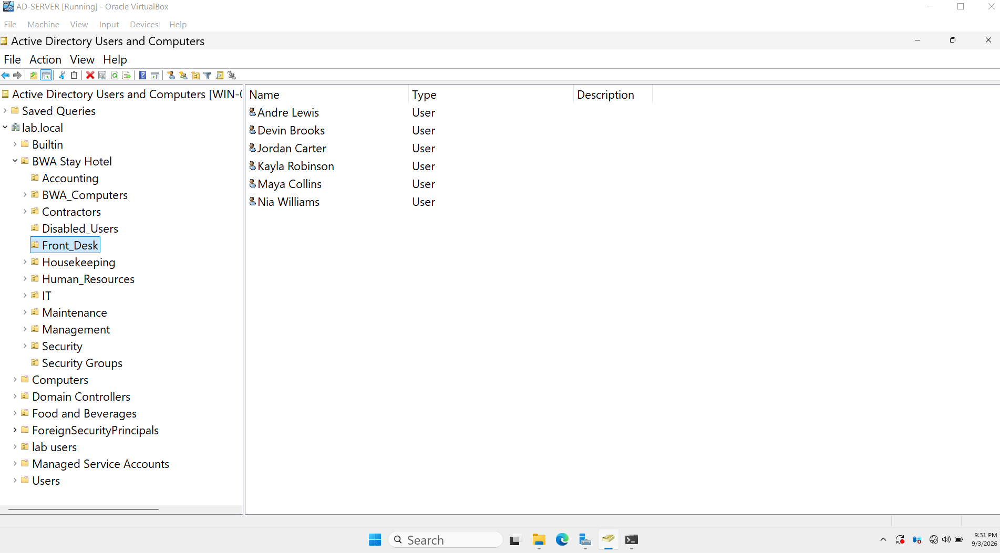
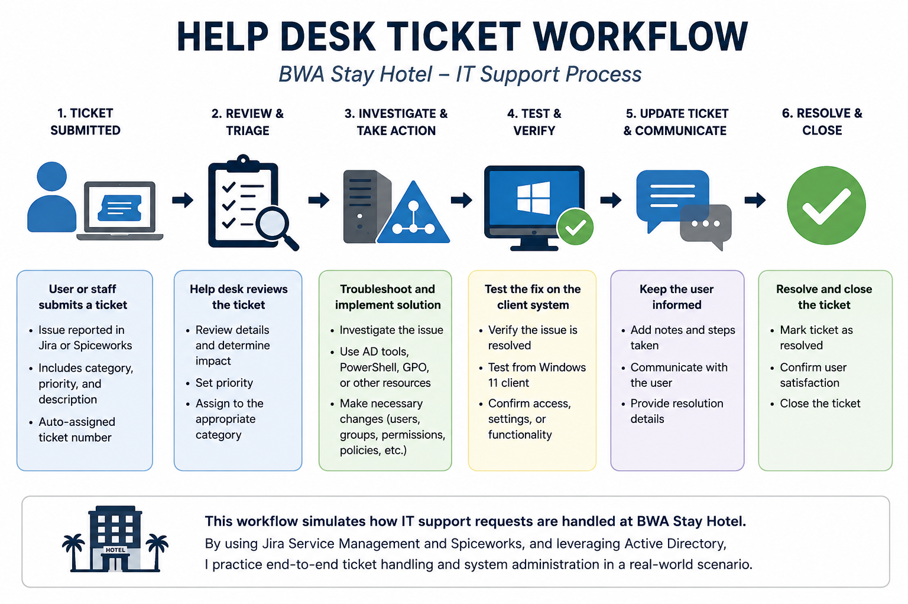
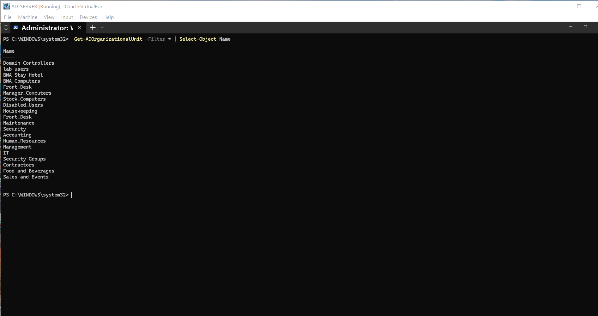

# Active Directory Enterprise Lab

## Project Overview

I built this home lab to gain hands-on experience with the work performed in an IT support and Windows system administration environment. Using the fictional **BWA Stay Hotel** organization, I practiced managing users, groups, permissions, and Active Directory while working through simulated help desk requests and troubleshooting problems.

The purpose of this project is to demonstrate practical experience—not just theoretical knowledge—with identity administration, access management, ticket handling, testing, and documentation.

## Lab Environment

| Component | Purpose |
|---|---|
| Windows Server 2025 | Hosts Active Directory Domain Services, DNS, Group Policy, file services, and IIS |
| Windows 11 | Domain-joined client used to test authentication, permissions, policies, and administrative changes |
| VirtualBox | Provides the virtualized lab environment |
| lab.local | Active Directory domain used by the BWA Stay Hotel environment |

## Active Directory Administration

I used Active Directory Users and Computers to practice common account-management and support tasks, including:

- Provisioning user accounts
- Resetting passwords
- Unlocking accounts
- Managing security-group membership
- Updating access based on job responsibilities
- Disabling accounts
- Verifying administrative changes

## Organizational Units and Security Groups

I created an Organizational Unit structure for BWA Stay Hotel based on its departments and administrative needs. The environment includes Accounting, Front Desk, Housekeeping, Human Resources, IT, Maintenance, Management, and Security.

I also created role-based security groups and separate Organizational Units for computers and disabled accounts. This structure allows access to be managed according to job responsibilities instead of assigning permissions directly to individual users.

## Help Desk Ticketing

I used Jira Service Management and Spiceworks to practice handling simulated support requests. My workflow included:

1. Reviewing the request and identifying the affected user or resource.
2. Investigating the account, group, policy, or access configuration.
3. Making the appropriate administrative change.
4. Testing and verifying the result.
5. Updating the ticket with the action taken and its status.

## PowerShell Administration

I used PowerShell alongside Active Directory Users and Computers to perform and verify administrative tasks. This helped me begin moving beyond GUI-only administration and understand how commands are constructed using cmdlets, parameters, values, objects, and properties.

Tasks practiced include:

- Viewing Organizational Units
- Creating Organizational Units
- Verifying Active Directory changes
- Viewing users and groups
- Reading and constructing Active Directory commands

## File and Access Management

I practiced creating departmental shared folders, assigning permissions, and testing access from the Windows 11 client. This demonstrated how Active Directory security groups can be combined with share and NTFS permissions to support role-based access control.

## Group Policy

I worked with Group Policy to centrally manage settings for domain users and computers. One exercise involved configuring a corporate wallpaper for the Windows 11 client and troubleshooting the policy when it did not apply as expected.

## Troubleshooting

Problems encountered during the lab required me to inspect configurations, isolate possible causes, test changes, and verify the outcome. Troubleshooting areas included:

- PowerShell syntax and command errors
- Active Directory configuration changes
- Domain login problems
- Network and DNS connectivity
- Group Policy application
- File-share and permission access

These issues strengthened my ability to troubleshoot methodically instead of relying on steps that only work when the environment is already configured correctly.

## Tools and Technologies

| Technology | How I Used It |
|---|---|
| Windows Server 2025 | Hosted domain and server services |
| Active Directory Domain Services | Managed users, OUs, groups, and accounts |
| Windows 11 | Tested domain logins, permissions, and policies |
| PowerShell | Performed and verified administrative tasks |
| Group Policy | Centrally managed domain settings |
| Jira Service Management | Tracked simulated IT support requests |
| Spiceworks | Practiced help desk ticket management |
| VirtualBox | Created and ran the virtual machines |
| DNS | Supported domain name resolution |
| IIS | Configured and tested internal web services |

## Skills Demonstrated

- Active Directory user and account administration
- Organizational Unit and security-group design
- Password resets and account unlocking
- User provisioning and account disabling
- Role-based access control
- Windows Server administration
- Windows domain-client testing
- Help desk ticket workflow
- PowerShell fundamentals
- Group Policy administration
- File-share and permission management
- DNS and connectivity troubleshooting
- Technical verification and documentation

## What I Learned

Building this lab helped me understand how identity, access, server administration, client testing, and help desk workflows operate together.

I became more comfortable managing users, groups, permissions, and Organizational Units while verifying changes from a Windows 11 domain client. I also learned that troubleshooting requires checking configurations, reviewing recent changes, testing possible causes, and confirming that the final resolution works.

PowerShell reinforced the importance of understanding command structure instead of relying on copied scripts. Jira Service Management and Spiceworks helped connect the technical work to a realistic support process from the initial request through testing and resolution.
