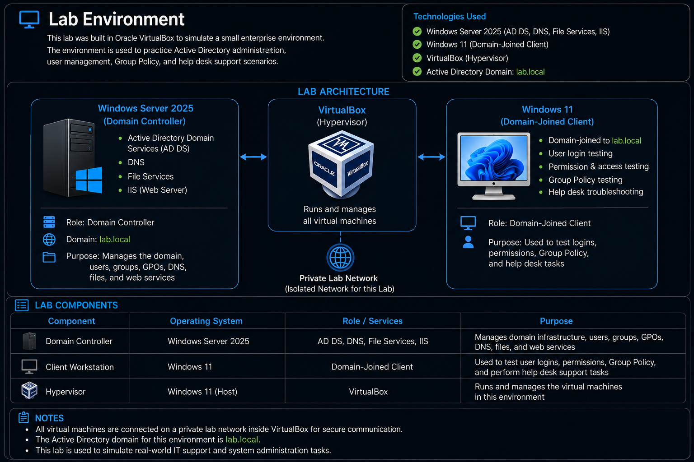

# Active-Directory-Enterprise-Lab
## Project overview
I built this lab to get hands-on experience with the type of work I would be doing in a real IT support environment. I wanted to practice managing users, groups, permissions, and Active Directory while also working through simulated help desk tickets and troubleshooting problems as they came up. The goal was to get more comfortable actually doing the work instead of only learning about it.
## Lab Environment
- **Windows Server 2025** – Used as the server for the Active Directory environment.
- **Windows 11** – Used as the client machine to test user logins, permissions, and changes made in Active Directory.
- **VirtualBox** – Used as the hypervisor to create and run the virtual machines.
 

## Active Directory

I used Active Directory to practice common account management and support tasks. This included resetting passwords, unlocking accounts, provisioning new users, managing access, and disabling accounts when they were no longer needed.

## Organizational Units and Security Groups

I created an OU structure for the BWA Stay Hotel to organize users and computers based on their departments and roles. The environment includes Accounting, Front Desk, Housekeeping, Human Resources, IT, Maintenance, Management, and Security.

I also created security groups for role-based access and separate OUs for computers and disabled user accounts. This helped me practice keeping Active Directory organized while managing access based on a user's job responsibilities.

> Screenshot evidence: BWA Stay Hotel OU structure and security groups

## Help Desk Ticketing

I used Jira Service Management and Spiceworks to work through simulated help desk tickets based on common IT support requests. I practiced reviewing the issue, making the needed changes in Active Directory, testing my work, and then updating the ticket based on the result.

## PowerShell Administration

I used PowerShell alongside Active Directory Users and Computers to perform and verify administrative tasks. Instead of relying only on the graphical interface, I practiced using Active Directory cmdlets to view and manage the environment.

Some of the tasks I practiced included:

- Viewing Organizational Units
- Creating new Organizational Units
- Verifying changes made in Active Directory
- Viewing users and groups
- Learning how PowerShell commands are structured using cmdlets, parameters, and values

I am continuing to build my PowerShell skills so I can perform more Active Directory and IAM tasks through automation instead of relying only on the GUI.

> Evidence to add: PowerShell commands and output from the Active Directory lab
> Evidence to add: Jira Service Management and Spiceworks ticket screenshots

## File and Access Management

I practiced managing access to shared resources based on a user's department and job responsibilities. I created shared folders for different departments, assigned permissions, and tested access from the Windows 11 client.

This helped me understand how Active Directory security groups can be used with file permissions so access can be managed by role instead of giving permissions to users individually.

> Evidence to add: Shared folder permissions and mapped drive access from the Windows 11 client.

## Group Policy

I used Group Policy to practice managing settings for domain users and computers from a central location. One of the policies I worked with was deploying a company wallpaper to the Windows 11 client.

This gave me hands-on experience creating and applying Group Policy while also troubleshooting when a policy did not apply or behave as expected.

> Evidence to add: Group Policy configuration and successful policy application on the Windows 11 client.
>
> ## Tools and Technologies Used

| Technology | How I Used It |
|---|---|
| Windows Server 2025 | Hosted the Active Directory domain and server services |
| Active Directory Domain Services | Managed users, OUs, security groups, and accounts |
| Windows 11 | Domain-joined client used for testing and verification |
| PowerShell | Performed and verified Active Directory administrative tasks |
| Group Policy | Practiced centrally managing domain user and computer settings |
| Jira Service Management | Worked through simulated IT support tickets |
| Spiceworks | Practiced help desk ticket management and support scenarios |
| VirtualBox | Created and ran the virtual lab environment |
| DNS | Supported domain name resolution within the AD environment |
| IIS | Configured and tested web services within the lab |

> ## Troubleshooting

Throughout the lab, I ran into different issues that required me to slow down, check my configuration, and figure out what was causing the problem.

Some examples included troubleshooting PowerShell command errors, correcting Active Directory changes, and working through login and connectivity issues between the server and Windows 11 client.

These situations helped me get more comfortable with troubleshooting instead of only following steps when everything works correctly.

> Evidence to add: Troubleshooting screenshots and short case studies
>
> ## Skills Demonstrated

- Active Directory user and account management
- Organizational Units and security groups
- Password resets and account unlocking
- User provisioning and account disabling
- Role-based access and permissions
- Windows Server 2025 administration
- Windows 11 domain client testing
- Help desk ticket workflow
- Jira Service Management
- Spiceworks
- PowerShell administration
- Troubleshooting and verification
- VirtualBox virtualization

