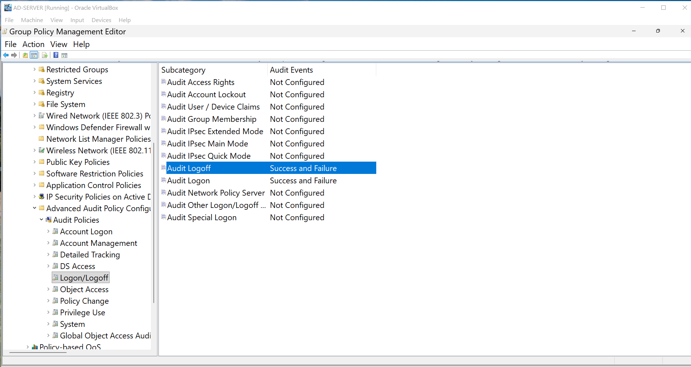
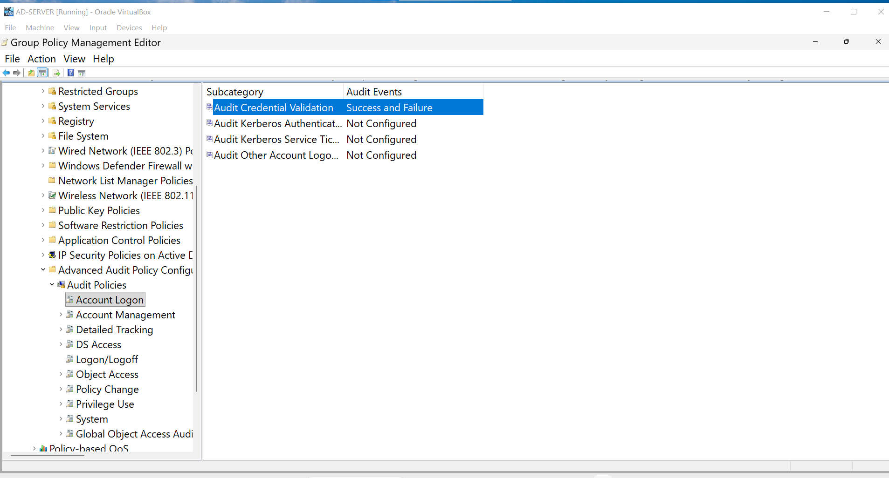
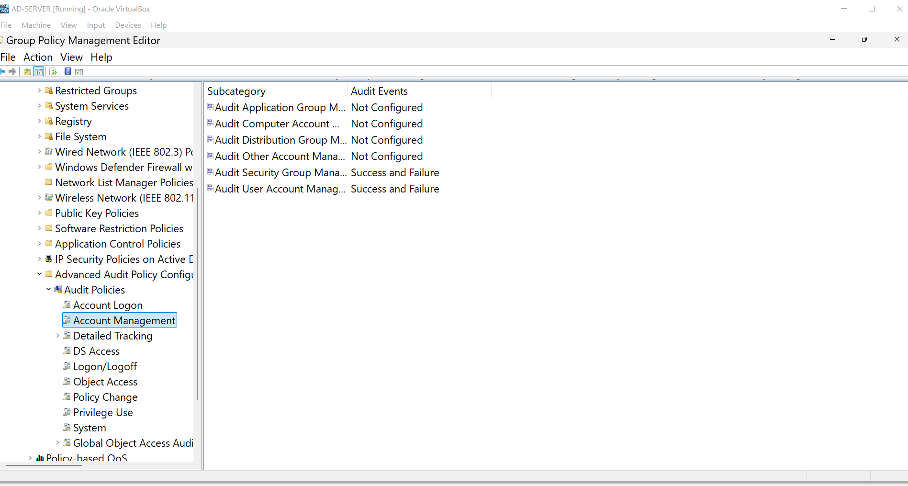

# Security Auditing

## Overview

I configured auditing on the domain controller so Windows can record login activity and changes made to accounts and security groups. This gives me information I can use when investigating login problems or checking administrative changes.

## Logon Auditing

I enabled both successful and failed logon auditing. This records whether a login attempt worked or failed.

## Credential Validation

I enabled successful and failed credential validation auditing. This records domain password checks handled by the domain controller.

## Account Management

I enabled auditing for user account and security group management. This helps track password resets, account changes, disabled accounts, and group membership changes.

## Verification

The audit policies are configured. The next step is to create a failed login and locate the matching event in Event Viewer.
