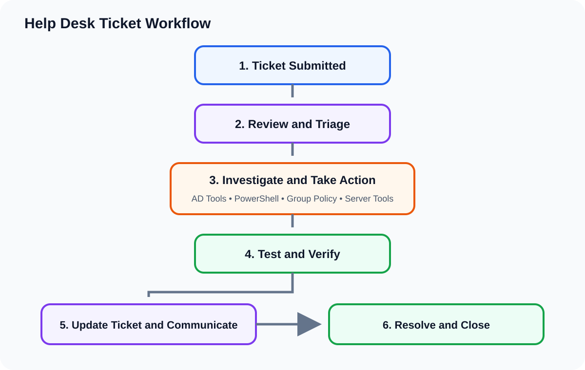

# Help Desk Ticket Lab

## Overview

I created this part of the project to practice handling support requests from the time they come in until they are resolved.

The tickets are based on problems that could happen at BWA Stay Hotel. I used Jira Service Management and Spiceworks to keep track of the requests, the work I did, and the final result.

## How I Worked Through Tickets

For each ticket, I followed the same general process:

1. Read the request and figure out what the user needed.
2. Check the affected account, computer, group, or resource.
3. Look at the current setup before changing anything.
4. Make the needed change in Active Directory, PowerShell, Group Policy, or Windows Server.
5. Test the change from the Windows 11 client when needed.
6. Add notes explaining what I did.
7. Make sure the issue was fixed before closing the ticket.

The individual case studies show the problem, the work I completed, and how I checked the result.

## Ticket Case Studies

[Department Folder Permission Troubleshooting](department-folder-permissions.md)

[Password Reset for Fabien P.](password-reset-fabien-p.md)

I found department groups inheriting access to folders they did not need. I corrected the main folder, department folder, and share permissions. The Windows 11 access test is still pending.

## Types of Tickets I Practiced

### Account Support

* Password resets
* Locked accounts
* Disabled accounts
* Login problems

### User Administration

* Setting up new users
* Department and role changes
* Security group changes
* Employee offboarding

### Access Support

* Department folder access
* Mapped drive problems
* File and NTFS permissions
* Removing access that was no longer needed

### Windows and Domain Support

* Domain login problems
* Group Policy problems
* DNS and connection checks
* Windows 11 testing

## What I Include in a Ticket Case Study

Each completed case study will show:

* The original request
* The affected user or computer
* What I checked
* What caused the problem
* What I changed
* Screenshots of the work
* How I tested the result
* The final notes added to the ticket

I use the BWA Stay Hotel employee roster for tickets involving existing employees. I only add a new name when the ticket is for a new hire. This keeps all of the tickets connected to the same company and environment.

## Skills I Practiced

* Handling support tickets
* Active Directory account support
* Setting up and disabling users
* Managing access through security groups
* Password and account lockout support
* Troubleshooting file permissions
* Troubleshooting Group Policy
* Checking changes with PowerShell
* Testing solutions
* Writing clear ticket notes
