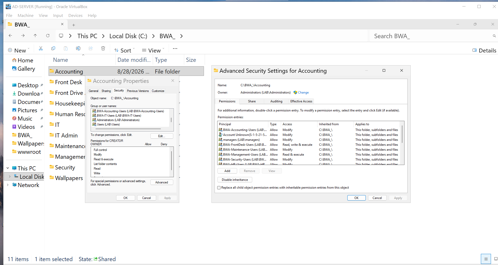
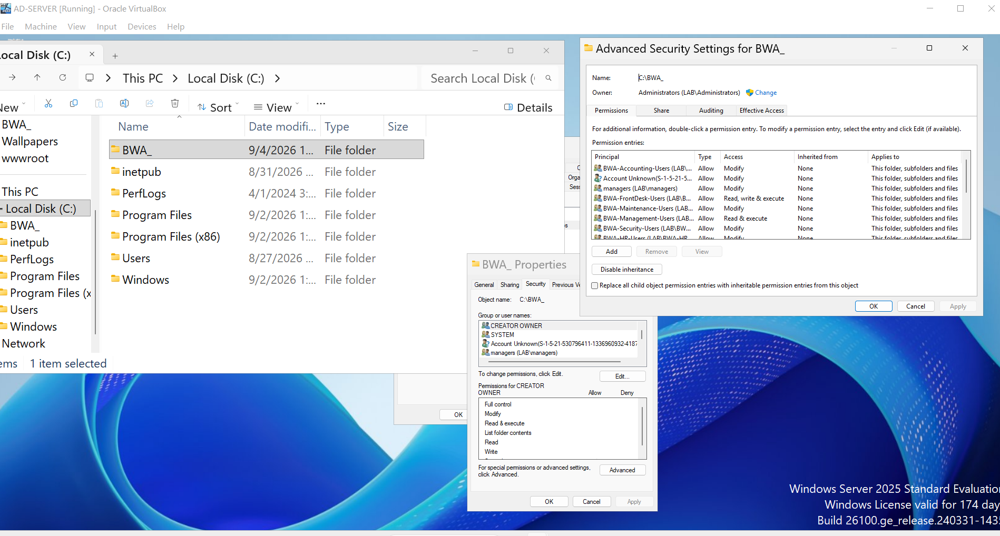
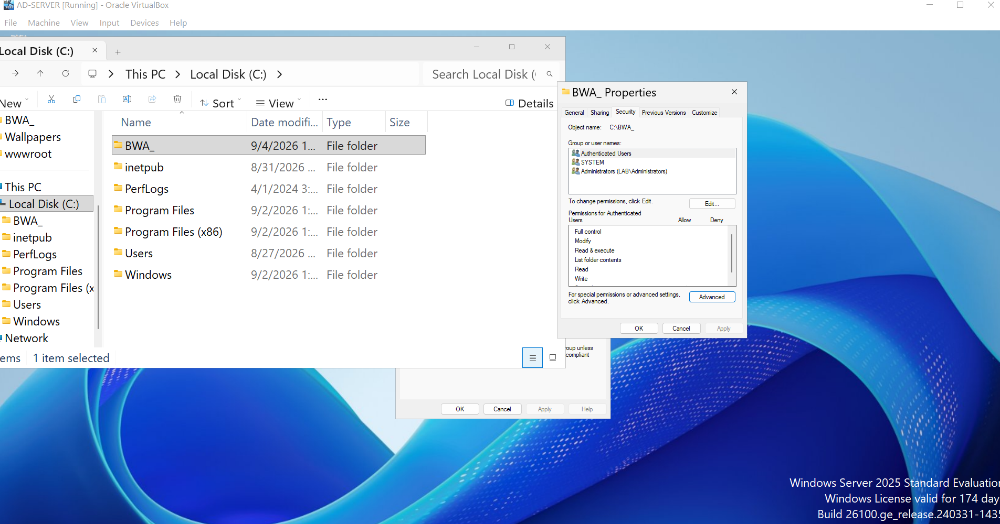
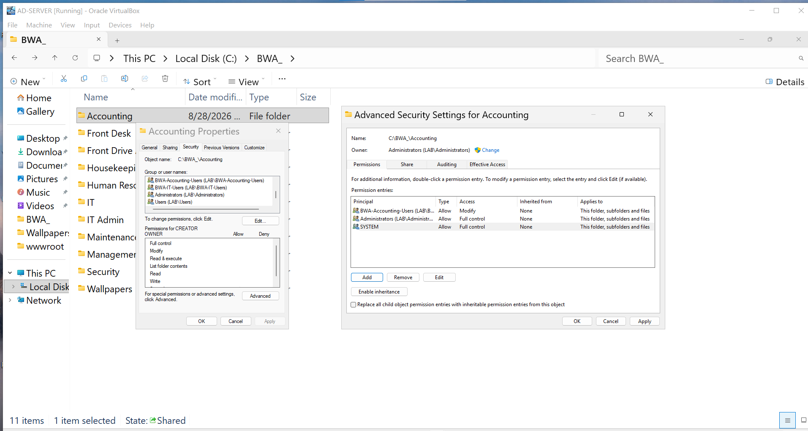
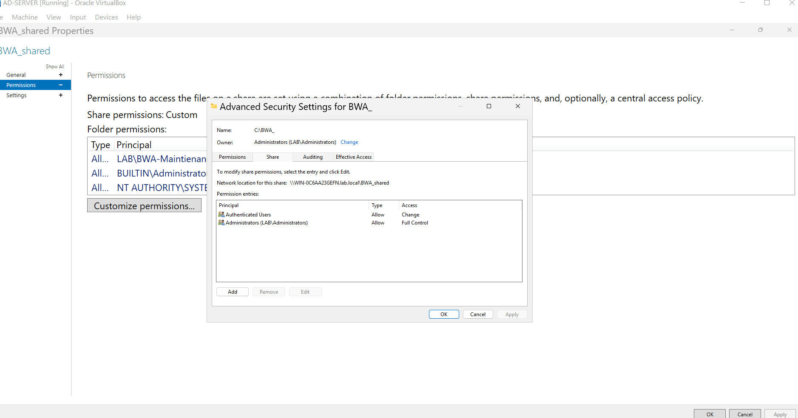

# Department Folder Permission Troubleshooting

## Issue

While checking the Accounting folder, I noticed that users from other departments had access they did not need. The Accounting folder was inheriting permissions from the main `C:\BWA_` folder.

## What I Checked

I opened the advanced security settings for the Accounting folder and checked where each permission came from. Several department groups were inherited from `C:\BWA_` and applied to the folder, its subfolders, and its files.

I also checked the main folder and the `BWA_shared` share permissions.

## Cause

The department groups were added to the main `C:\BWA_` folder with permissions that applied to every folder below it. Because of that, users could inherit access to folders outside their own department.

The share permissions also allowed only the Accounting group, which could stop other departments from reaching their own folders through the share.

## Fix

I cleaned up the main folder permissions so it keeps the basic access needed to reach the department folders.

* SYSTEM has Full control
* Administrators have Full control
* Authenticated Users have Read and execute on the main folder only

I then set the Accounting folder so the Accounting group has Modify access. Administrators and SYSTEM keep Full control.

I repeated the same setup for the other department folders using the matching department group.

I also corrected the share permissions.

* Authenticated Users have Change access
* Administrators have Full control

## Result

The server permissions are now separated by department. Each department folder uses its matching security group instead of inheriting every department group from the main folder.

The server side setup is complete. I still need to test from the Windows 11 client with one authorized user and one user from a different department. That will confirm that the correct user can open the folder and the other user receives Access Denied.
