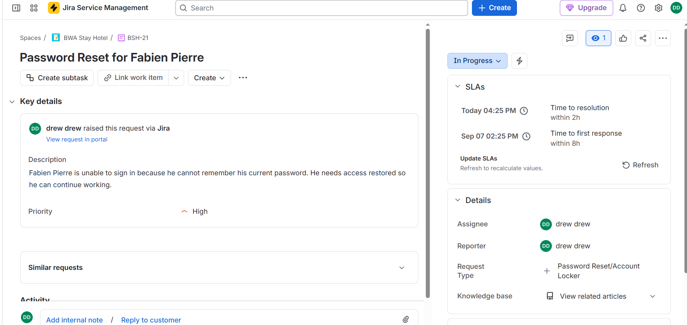
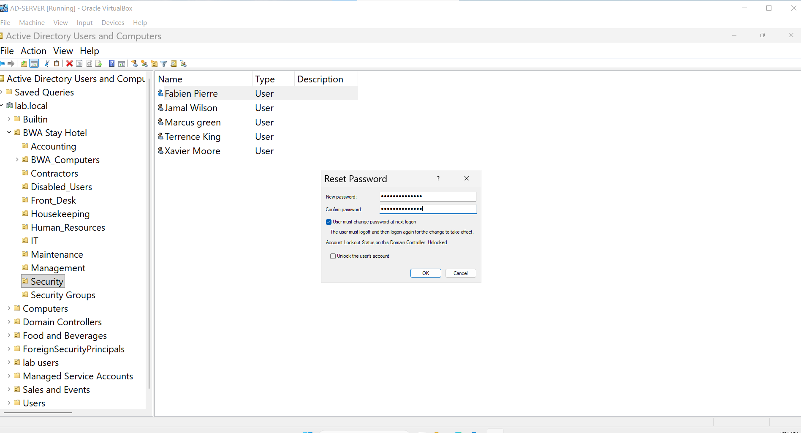
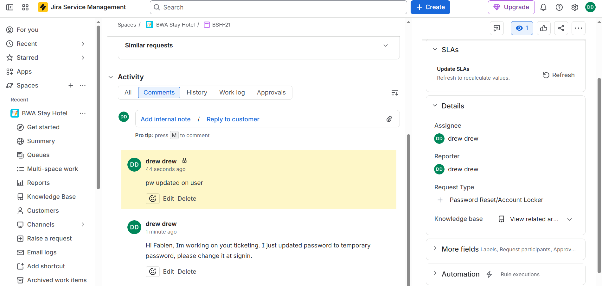
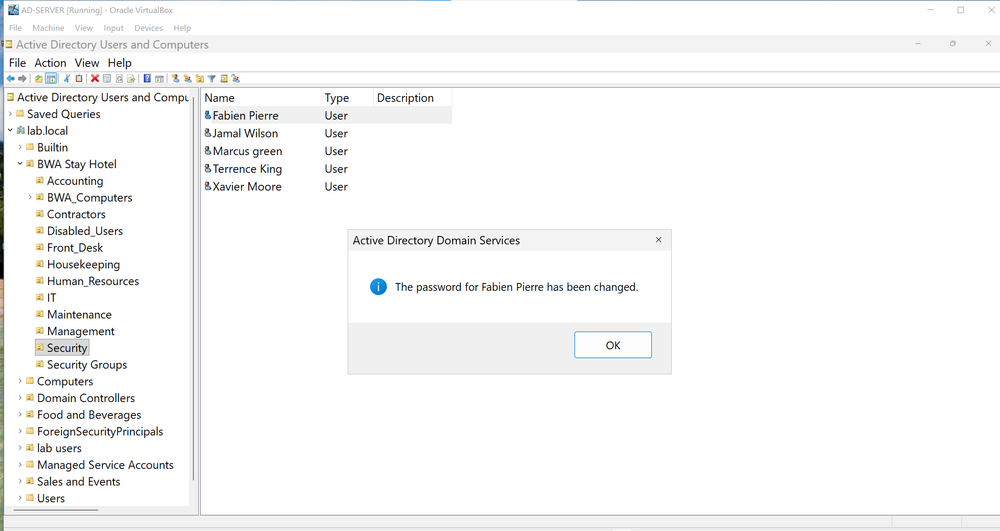

# Password Reset for Fabien P.

This case uses a fictional employee account from my BWA Stay Hotel home lab.

## Ticket

BSH 21

## Request

Fabien P. could not sign in because he did not remember his current password. The request was marked High priority and moved to In Progress before I started working on the account.

## What I Checked

I located Fabien P. in Active Directory Users and Computers and confirmed I was working with the correct lab account.

## Action Taken

I reset the password in Active Directory and required Fabien to change the temporary password at his next sign in. The password reset completed successfully.

## Ticket Update

I added an internal note explaining what I changed and moved the request to Pending Verification.

## Result

The server side password reset is complete. The ticket will remain in Pending Verification until Fabien successfully signs in and changes the temporary password.
